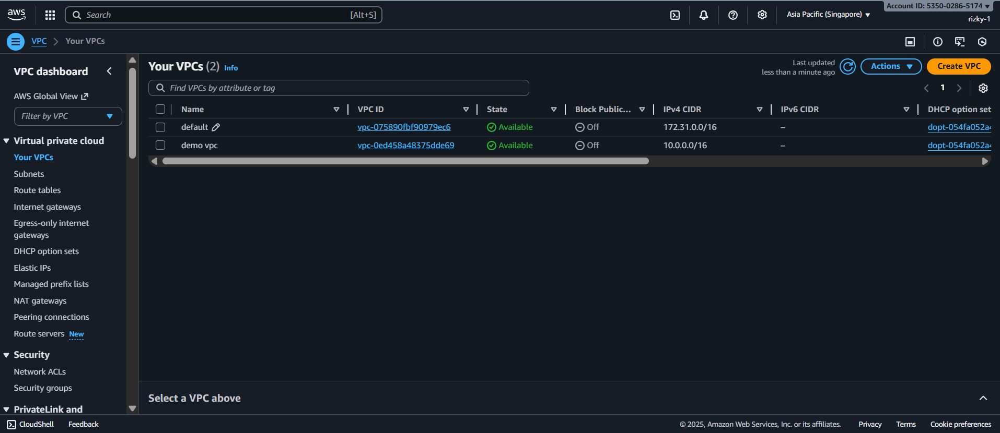
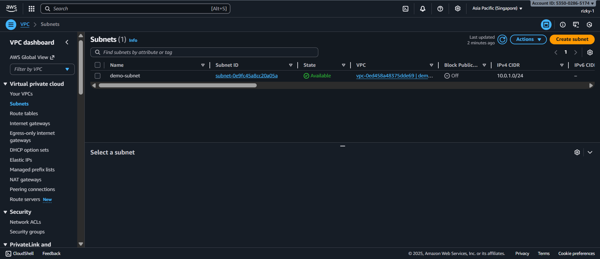
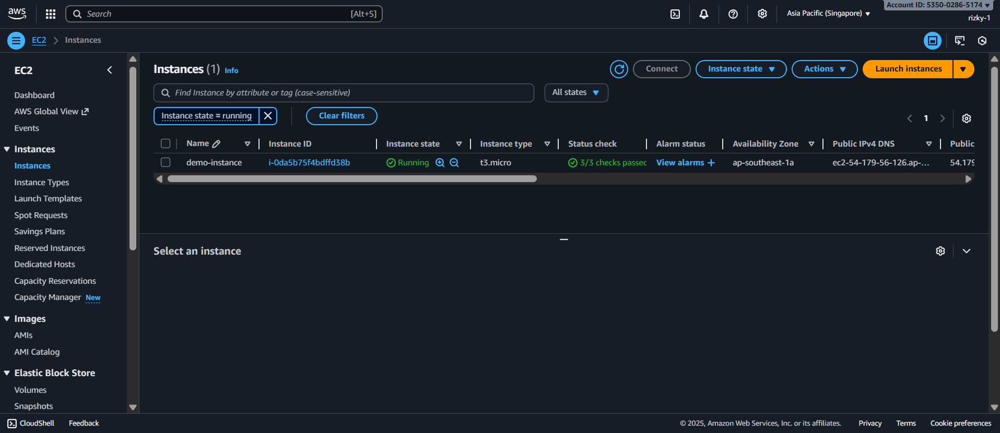
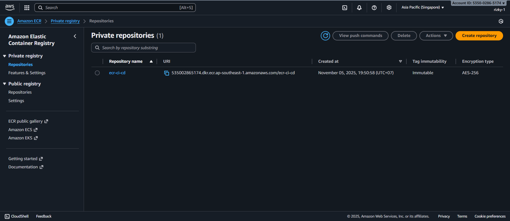
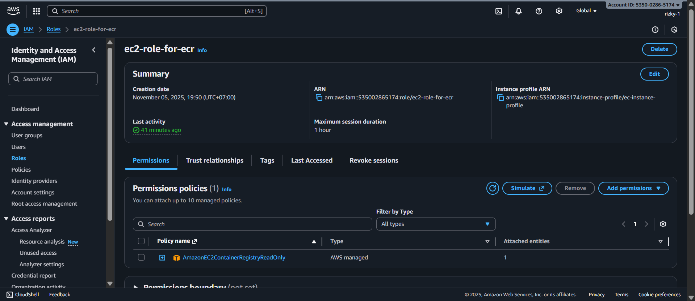
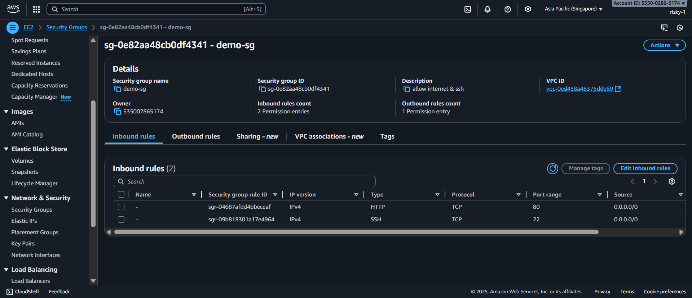

# Node.js Web Application with CI/CD on AWS


This repository demonstrates how to **deploy a Node.js web application** using **Terraform (Infrastructure as Code)** and a **simple CI/CD pipeline with GitHub Actions**.  

The pipeline builds a Docker image, pushes it to ECR, and deploys it to an EC2 instance.


## Table of Contents

1. [Project Overview](#project-overview)
2. [Prerequisites](#prerequisites)    
3. [Clone Repository](#clone-repository)  
4. [GitHub Secrets Setup](#github-secrets-setup)  
5. [Terraform Infrastructure Setup](#terraform-infrastructure-setup)   
6. [CI/CD Workflow](#ci-cd-workflow)  
7. [EC2 SSH Access](#ec2-ssh-access)  
8. [Verify Deployment](#verify-deployment)   
9. [Key Features](#key-features)

## Project Overview

This project demonstrates a **full DevOps flow** for deploying a Node.js application:

- Provision AWS infrastructure with Terraform  
- Create IAM roles for secure access to AWS resources  
- Build and push Docker images to AWS ECR  
- Deploy and run containers on EC2 instances  
- Simple CI/CD pipeline using GitHub Actions  
- SSH access for troubleshooting and manual verification  


## Prerequisites
Before you begin, ensure that you have the following prerequisites installed on your local machine: Git, Node.js & npm, Docker, Terraform, AWS CLI, and an SSH client.

### AWS Setup
To ensure the CI/CD pipeline from GitHub Actions to EC2 works correctly, you need two AWS entities:

#### 1. IAM User
- Must have the policy `AmazonEC2ContainerRegistryFullAccess` to allow push/pull operations to ECR.  
- Save the **Access Key ID** and **Secret Access Key** — these will be added as GitHub Secrets for the workflow.
- **Note:** This user already exists and is managed manually.

#### 2. IAM Role for EC2
- Must have the policy `AmazonEC2ContainerRegistryReadOnly`.  
- Attach the IAM Role to an **Instance Profile** and associate it with the EC2 instance that will run the Docker containers.
- **Note:** You don’t need to create this manually; the terraform modules handle it for you.

## Clone Repository

```bash
git clone https://github.com/username/simple-iac-docker-ci-cd.git
cd simple-iac-docker-ci-cd
```

## GitHub Secrets Setup

Go to **Settings → Secrets → Actions** and add the following secrets:

- `AWS_ACCESS_KEY_ID` → IAM user for GitHub Actions  
- `AWS_SECRET_ACCESS_KEY` → IAM user for GitHub Actions  
- `AWS_REGION` → e.g., `ap-southeast-1` (depends your region)
- `EC2_USER` → e.g., `ubuntu` (depends on AMI)  
- `EC2_PRIVATE_KEY` → Private key for EC2 SSH  
- `EC2_HOST` → Instance IP public 

## Terraform Infrastructure Setup

Before running `terraform apply`, make sure the AWS CLI is configured with your existing IAM user credentials. This user must have `AmazonEC2ContainerRegistryFullAccess` so that GitHub Actions can push Docker images to ECR.

```bash
aws configure
```

Enter your **Access Key ID**, **Secret Access Key**, and **Region**.

### Terraform Steps

1. **Install Terraform** (v1.x) if not already installed.  
2. **Initialize Terraform** (downloads providers, sets up backend):
```bash
terraform init
```
3. **Review planned resources** (optional but recommended):
```bash
terraform plan
```
4. **Apply the infrastructure**:
```bash
terraform apply
```
- Confirm when prompted (`yes`).

### What Terraform Will Create

- **VPC and Subnet**




- **EC2 instance** with a Security Group allowing:
  - HTTP (port 80) for your web app  
  


- **ECR repository** for storing Docker images



- **IAM Role for EC2** (Terraform-managed) to pull Docker images securely 



- **Security Groups** for network rules



5. **Destroy the infrastructure** (optional)
If you want to tear down the infrastructure and remove all resources created by Terraform you can follow these steps:
```bash
terraform destroy
```


### Notes / Tips

- **IAM User for GitHub Actions** is **not** created via Terraform; it must already exist. Add its credentials as GitHub Secrets:
  - `AWS_ACCESS_KEY_ID`  
  - `AWS_SECRET_ACCESS_KEY`  
  - `AWS_REGION`
- Make sure your EC2 key pair (`.pem`) matches the instance created in Terraform so you can SSH in if needed.  
- Always double-check the default region in `aws configure` and your Terraform provider settings.  

> With this setup, Terraform will provision the infrastructure needed to run your Node.js app via Docker on EC2, and GitHub Actions can push/pull images to/from ECR seamlessly.

## CI/CD Workflow (GitHub Actions)

1. **Trigger:** Push to `main` branch  
2. **Steps:**  
   - Checkout repository  
   - Configure AWS credentials  
   - Login to Amazon ECR  
   - Build Docker image and tag with `github.sha`  
   - Push image to ECR  
   - SSH into EC2  
   - Pull latest image from ECR  
   - Stop old container (if exists)  
   - Run new container on port 80 → mapped to app port 3000  

3. **Optional:** Manual trigger via **Actions → Run workflow**.  


## EC2 SSH Access

To verify or debug the deployment:

```bash
ssh -i path/to/key.pem ubuntu@<EC2_PUBLIC_IP>
```

**Commands to check container:**
```bash
docker ps
docker logs <container_id>
```

**Stop and remove old container manually (if needed):**
```bash
docker stop app || true
docker rm app || true
```

## Verify Deployment

After the deployment process is complete, make sure the application is running correctly on the EC2 instance. From your local machine or browser, run the following command:

```bash
curl http://<EC2_PUBLIC_IP>/
```
If successful, you should see a response from your application (for example, a “Hello World” message or the HTML output of your web server).

You can also open it directly in your browser:
```bash
http://<EC2_PUBLIC_IP>/
```
> 💡 **Tips:**  
> - Make sure the EC2 instance’s **security group** allows inbound traffic on **port 80 (HTTP)**.  
> - If your application runs on a different port (e.g., 8080), update the URL to `http://<EC2_PUBLIC_IP>:8080/`

## Key Features

- End-to-end deployment pipeline for Node.js apps  
- Infrastructure as Code (Terraform)  
- Dockerized applications  
- Simple CI/CD with GitHub Actions  
- Secure EC2 access with IAM roles  
- Step-by-step reproducible process

